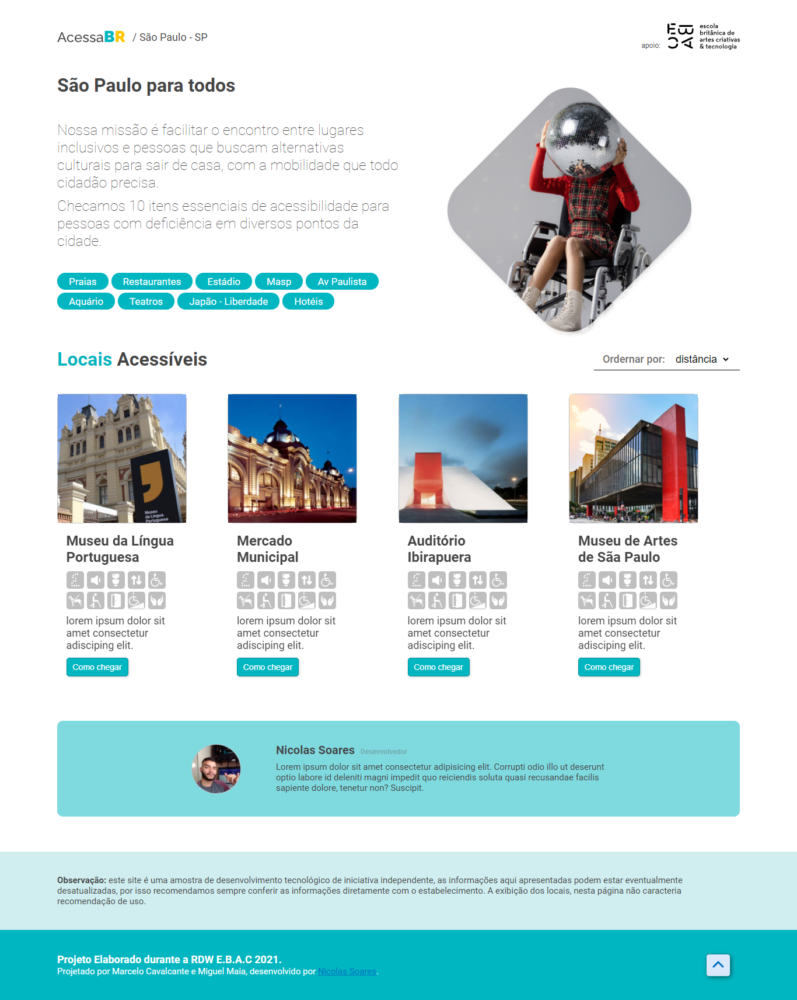
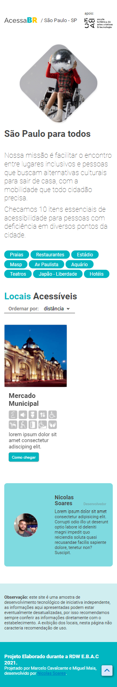

<h1 align="center">
  Encontre lugares acessíveis para pessoas com deficiência.
</h1>
<br>

##  Informações 📖

<br>

- <b>As informações do projeto são fictícias.</b>

<br>
<br>

## Screenshot 📸

<br>

<p align="center">
    
</p>
<p align="center">
    
</p>


##  Tecnologias utilizadas 🚀

<br/>
  <br/>
  <br/>
<p align="center">
    
</p>
<br>
<br>
<p align="center">
    
</p>
  
  
<br>
<br>

#  Como rodar/acessar 💻


### Para rodar o projeto na sua máquina local:

```bash
# Clonar o repositório
git clone https://github.com/d3vnicolas/acessabr.git

# entrar na pasta do repositório
cd acessabr

# instalar node-modules 
npm install

# instalar json-server  
npm install -g json-server

# rodar a api local
json-server -p 3333 src/spi/places.json

# iniciar o web app 
npm start
```
<br>

##  Contribua comigo 🤗

<br/>

- Faça um fork desse repositório.
- Marque com star.
- Entre em contato para dúvidas ou sugestões.

<br>
<br>

##  Desenvolvedor 👨🏻‍💻

<table align="center">
    <tr>
        <td align="center">
            <a href="https://github.com/d3vnicolas">
                
            </a>
        </td>    
    </tr>
</table>
<h3 align="center">
   Feito com ❤️ por:  <a href="https://www.linkedin.com/in/nicolas-soares-887655220/" target="_blank"> Nicolas Soares </a>
</h3>
